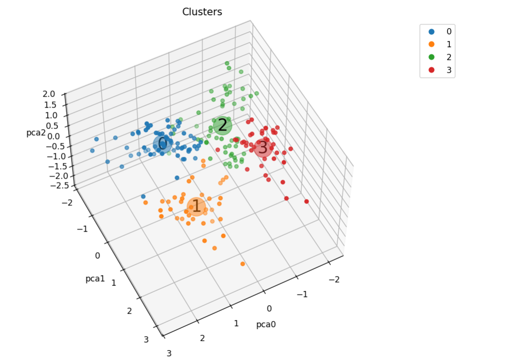

(www.linkedin.com/in/vinicius-monteiro-pina)
[](https://www.python.org/)

# Customer Segmentation for a Supermarket

A supermarket, through loyalty cards, has some basic data about its customers, such as age, gender, annual income, and spending score. This score is something the supermarket assigns to the customer based on defined parameters, such as customer behavior and purchase data. The supermarket wants to better understand its customers to formulate business strategies, and for this, they hired a data scientist to perform customer segmentation.



[Original Link for the Dataset](https://www.kaggle.com/vjchoudhary7/customer-segmentation-tutorial-in-python)


<div style="text-align: center;">
  <a href="https://www.linkedin.com/in/vinicius-monteiro-pina" target="_blank">
    
  </a>
</div>


## Objectives

The goal of this project is to show students how to segment customers based on their purchase data. In a real scenario, such segmentation could be used by the supermarket to better understand customers and formulate business strategies accordingly.

During the course, I demonstrated the importance of data preprocessing and exploratory data analysis. Additionally, I showed how to use the K-Means algorithm to perform customer segmentation.

Detailed objectives:

- Compare the results of clustering with and without data preprocessing, highlighting the importance of data preprocessing.
- Present a Data Science project structure using notebooks, scripts, reports, and a GitHub repository.
- Introduce good programming practices in Python, such as using functions and script files to facilitate code reuse.
- Show best practices for using SciKit-Learn, such as using pipelines.

## Repository Structure

The repository is structured as follows:

```
├── dados
├── imagens
├── modelos
├── notebooks
├── reports
```

- In the `DATA` folder are the datasets used in the project. The `Mall_Customers.csv` file is the original dataset. The other files are the datasets generated during the project.
- The `images` folder contains the images used in this README.
- The `Models` folder contains the models generated during the project. 
  - [`Main.ipynb`](Main.ipynb): notebook com a análise exploratória dos dados usando [ydata-profiling](https://github.com/ydataai/ydata-profiling) e Seaborn.
  - `Main.ipynb`: notebook com função para visualização em 3D dos clusters gerados pelo K-Means (sem pré-processamento por questões didáticas).
  - [`Main.ipynb`](Main.ipynb): notebook com a clusterização dos dados usando K-Means **com pré-processamento** utilizando pipelines do Scikit-Learn.
  - [`Pipeline_Pca.ipynb`](Pipeline_Pca.ipynb): notebook com a clusterização dos dados usando K-Means após redução de dimensionalidade com PCA utilizando pipelines do Scikit-Learn.
  - [`Functions.py`](Functions.py): arquivo com funções auxiliares utilizadas nos notebooks.
  - [`Main.ipynb`](Main.ipynb):[ydata-profiling](https://github.com/ydataai/ydata-profiling).

## Dataset Details and Summary of Results

The dataset used is contained in the file [`Mall_Customers.csv`](DATA/Mall_Customers.csv):

- `CustomerID`: Customer ID
- `Gender`: Customer gender
- `Age`: Customer age
- `Annual Income (k$)`: Customer annual income
- `Spending Score (1-100)`: Customer spending score

With the pipeline performing preprocessing, PCA, and K-Means, the dataset was segmented into 5 clusters, as shown in the figures below:


- Cluster 0 - Moderate spending score, low income, high age
- Cluster 1 - Low spending score, high income, moderate age
- Cluster 2 - High spending score, low income, young age
- Cluster 3 - High spending score, high income, young age


transforming the points above into a table:

spending score| Income | age | Cluster Number
--- | --- | --- | ---
Moderate | low | high | 0
Low | high | moderate | 1
Alta | Baixa | young | 2
High | high | young | 3


## How to Reproduce the Project

The project was developed using Python 3.11.4. To reproduce the project, create a virtual environment with Conda or a similar tool with Python 3.11.4 and install the libraries below:

| Biblioteca   | Versão |
| ------------ | ------ |
| Matplotlib   | 3.7.1  |
| NumPy        | 1.24.3 |
| Pandas       | 1.5.3  |
| Scikit-Learn | 1.3.0  |
| Seaborn      | 0.12.2 |

These are the main libraries used in the project. The report was generated with the [ydata-profiling](https://github.com/ydataai/ydata-profiling), library, install it if you want to reproduce the report. For an interactive 3D plot,  [ipympl](https://matplotlib.org/ipympl/).


- I learned to develop this project with the online training company 'Hashtag Programação'.